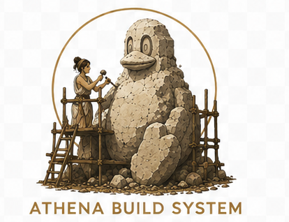

<p align="center">
  
</p>

# Athena-Build

## Features
- **Custom Linux Distro** — End to end from source to repo publishing
- **A whole derivative, built from source** — resolves the full dependency closure of your custom package list and compiles every package from upstream Debian source.
- **Multiple image surfaces** — a live ISO, a from-source installer ISO, and a pre-installed qcow2 disk image.
- **Patch at every layer** — fine control on source, pre-install, and post-install patching, plus a fork system with an identity collision gate.
- **Reproducible and signed** — GPG-signed apt metadata (`Release`/`InRelease`) for repository.
- **Federated publishing** — push signed, append-only updates from your own apt mirror that multiple builders can extend.
- **One interface, fully transparent** — a curses TUI (with headless and HTTP-API backends) drives the entire pipeline.

## Introduction
Athena Build system is a (mostly) hands off toolchain to build and ship custom Debian Linux distribution from source (the catch). The differential being, instead of wrapping upstream packages you get to own the build process end to end from building upstream debian sources to managing your own repo. Post this build the running system should look to your own repository, not Debian's, for updates — runtime independence is the aim, even if the build itself still draws its source from upstream Debian. 

The genesis of this project came from the conversation - while the Linux ecosystem as part of the FOSS world, can we really build the distro from source? As that wild idea took some roots it got convoluted into an idea - if we can do that then why cannot we have a public toolchain that allows me to build a Ubuntu from Debian or CentOS from RedHat. Why not let people build, customise and maintain their own distro end to end. The question as to why a sane person would even do that was conveniently sidestepped in the said conversation.

Athena is not reinventing the wheel, it's just repackaging the car. Other projects own individual links of this chain, and often own them better — Linux From Scratch builds a system from source by hand, Yocto does industrial source builds for embedded targets, the Open Build Service publishes signed packages at scale, live-build composes Debian ISOs. Athena's identity is to do the whole chain at once, for a complete Debian derivative: 
- Build the entire distro's dependency closure from source, 
- Hold a clean fork identity, pin every input to a snapshot so the result is reproducible,
- Publish it as a signed, append-only, federated mirror that multiple builders can extend. 

To our knowledge no other open-source tool does that entire chain, transparently, end to end. As a product it is still young, infant to be exact, and the road from here to something you would run on real hardware in anger is, candidly, only for the brave. Many more real builds, more community adoption on real machines and real environments will help mitigate some of that pain.

### Reality Check
 - This will be a maturing solution and not immediately suitable to go to your boss and pitch your custom distro for the company (but don't let it stop you). See Project maturity below.
 - Can this be faster, YES. Is it worth making it faster (e.g. shifting to C, trading space with time, etc.) NO
 - It is NOT currently (or ever may be) supported by any of Debian Linux Houses (e.g. debian, ubuntu, etc.)
 - Does it have Bugs? - Yes. Many?? Maybeeee. Please reach out to me and lets fix what you find.
 - Remember, and this is especially important: it is a source build toolchain, it does nothing to upstream source packages. What you get is what you get. You will (rather quickly) realise as I have that just because source code is available doesn't mean it is amenable to being built. Fixing that is completely on you. You will learn to embrace a whole new level of 'oh, but it builds on my system'.
 - A practical note for anyone coming from RHEL: this project will be largely incomprehensible for the first afternoon. Conventions are different, assumed reading is different. Stick with it; the underlying ideas are the same.

### Background
The first question is always - What is Linux?  Linus Torvalds while studying at the University of Helsinki, wrote (for multiple reasons that I am not getting into here) a 'System V compatible' kernel inspired by a UNIX operating system clone called 'Minix', what we now ubiquitously call version 0.1 of the **Linux Kernel**. 

Unfortunately, the Kernel had no application ecosystem to run as remained as such an essential cog in a non-existing ecosystem. Then came along Richard Stallman and GNU, which brought along the application stack that gave it purpose, and hence was born the **Linux Distribution**, or more colloquially just called Distro - a collection of self serving programs. The conversation of distinction between 'Linux Distribution' and 'Linux OS' is a petridish for violence amongst geeks, but for the purpose of this project lets assert debian is a 'Linux Distribution' and stay away from the phrase OS as much as possible.

The first Linux distribution, called "Softlanding Linux System" (SLS), was released by 1992. and within the next three years we saw the advent of Slackware, Red Hat and Debian. The rest as they say is history.

PS: Red Hat vs Debian - Red Hat was founded with the goal of creating a commercial distribution of Linux that could be sold and supported. On the other hand, Debian was founded  with the goal of creating a community-driven Linux distribution that was completely free, open-source and built from scratch. We like debian.

A **package** is akin to SKU of software that can be installed and managed by the distribution's package manager. This is important - packages may intrinsically also define other packages as dependencies and it is usually the package manager's headache to install everything together. In this context Debian identifies an application, wraps the application's build system to produce the installables as a package construct, i.e. deb - debian package file, test it, patch it, and publish it in a repository.

If you can collect a set of packages that work together in a manner that makes the computer usable even if it's to play minesweeper, you have a distribution. If you can support it with updates via a online / offline repository you have a more mature practically usable distro that you can talk to your friends about. If you can ship it with packages or UX other distros don't usually ship you have a custom distro with (maybe) some unique appeal. 

***Athena enables you to create this distro of 'unique appeal' without having to hit your head on how to manage the distro but to focus on what to put in it.***

The sections that follow walk through what that looks like in practice — what to install on the host before you start, how to drive the build, where to look when something breaks (and it will).


## Building Image

### Intro

The build system is a curses TUI driven by `build-system.sh`. There is one shipped pipeline (`autorun`) that drives the build through to a verified chroot; the final ISO step is left as a separate manual command on purpose, so you have a chance to inspect or fiddle with the chroot before it gets sealed into a squashfs.

The pipeline (eight stages, plus one optional side-channel):

1. `cache build` — pulls `Packages` and `Sources` indices from each configured mirror, GPG-verifies the `InRelease` signature against `debian-archive-keyring`, and assembles an in-memory APT cache.
2. `cache parse` — resolves the package list in `config/pkg.list` into a closed dependency graph (binary deps + matching source packages).
3. `source sync` — fetches `.dsc`, `.orig.tar.*`, and `.debian.tar.*` files for every selected source.
4. `container init` — builds a per-release Docker image carrying the build-deps for the source packages.
5. `source build` — runs `dpkg-buildpackage` inside the container for each source, applies any patches under `patch/source/<pkg>/<ver>/`, drops the resulting `.deb` files (and `.udeb`s, when the source declares them) into `repo/`.  Default mode (= `source build pkg`) builds the **pkg.list closure only** — the user-choices layer minus live extras, installer udebs, and Recommends-only extras.  Layered subsets: `source build live` builds the live extras (live-boot, live-config, …); `source build installer` builds the udeb closure for the installer ramdisk + the installer-exclusive deb extras; `source build recommended` builds the depth-1 Recommends pulled in by `cache parse` for the future apt-repo.  A bracket-token like `source build live-boot-doc [nocheck]` overrides `DEB_BUILD_PROFILES` + `DEB_BUILD_OPTIONS` for that one build — useful when you want a `-doc` binary the default `nodoc` profile would skip.
6. `chroot build` — installs the built `.deb`s into a chroot under `buildroot/` in topo-sorted batches: the dpkg/dash/coreutils closure lands first (debootstrap-style essential bootstrap, so maintainer scripts run inside the chroot as early as possible), then the libc bootstrap cycle, post-install patch overlays, and the canonical libdevmapper/dmsetup/systemd cycle (ARCH-12).  Runs `chroot verify` automatically as its tail end.  What gets installed is a *surface closure* (SURFACES-01): bare `chroot build` is shorthand for `chroot build live` — the closure of `[Live] Groups` in `build.conf` (default `base, gnome-desktop`) plus `live.list`, with Recommends; `chroot build disk` builds the separate minimal disk-image chroot at `buildroot/disk` (closure of `[Disk] Groups`, default `base` — console + ssh, no GUI); `chroot build installer` builds the d-i installer-chroot (udeb closure rooted at `rootskel`+busybox init, no debs, no systemd; COMP-01a–g done).
7. `chroot verify` — the 8-check verifier from step 6, also invokable on its own (e.g. after a manual edit of the chroot tree).  Fails loud; gates `iso build live`.
8. `iso build live` — wraps the live chroot into a squashfs, runs `grub-mkrescue` to produce a hybrid BIOS/EFI bootable ISO under `image/`.  `iso build installer` is the parallel installer-ISO path — masters the installer chroot + bundles a manifest-driven `/cdrom/pool` (only what tasksel/d-i can actually install ships on the ISO; the rest stays mirror-only) and generates the tasksel software-selection menu from the signed package-selection lockfile at mastering time (edit a `pkg.list` group, re-run `cache parse` + `iso build installer`, and the menu follows — no fork rebuild).  Verified end-to-end through `finish-install.d/20final-message` on VMware BIOS + EFI (real-hardware coverage open under COMP-01h).

Plus, off to one side:

- `iso build disk [size_gb]` (COMP-09, decoupled by SURFACES-01) — pre-installed bootable qcow2 disk image from its **own** minimal chroot at `buildroot/disk` (run `chroot build disk` first; the gate is `chroot_disk_ready`, independent of the live chroot).  Output: `image/<distribution>-<version>-<arch>.qcow2`.  Boots directly into the running OS — no installer step.  Extra host prereqs: `rsync`, `dosfstools` (`mkfs.fat`), `qemu-utils` (`qemu-img`).  Defaults to 5 GB sparse; override per-invocation or via `[Build] DiskImageSizeGB`.
- `source tunnel` — for packages you've explicitly *chosen not* to build from source.  Pulls the prebuilt `.deb` straight from the base Debian repo and drops it into `repo/` alongside the from-source builds.  Reads the `Tunneled` list in `config/build.conf` (or accepts package names as args).  Not part of `autorun` — opt-in, run after `cache parse` and before `chroot build`.  (Was `repo tunnel` before it moved under `source`.)

Each stage sets a `BuildFlags` bit on success; later stages refuse to run unless their prerequisites are set.  `autorun` walks stages 1–6 in order (which gets you a verified chroot) and bails on the first failure; you then run `iso build live` once you're happy.

### Prerequisites

A Debian-derived host. Development happens on Debian bookworm; trixie should work, current Ubuntu LTS likely too. You need:

- **sudo**. The chroot install steps shell out to `mount --bind`, `chroot`, `dpkg`. Run the build as a normal user; the TUI will prompt for your sudo password at the start of `chroot build` (and again at the start of `iso build live`) and zero it from memory the instant each command exits — pass or fail (see STA-07).
- **Docker Engine** (not Docker Desktop). The source-build container runs build-deps in isolation. See [`docs/install-docker.md`](docs/install-docker.md) for the apt incantation that gets you an up-to-date Engine from Docker's own repo (the distro packages are usually too old).
- **Python ≥ 3.9** plus `python3-apt`, `python3-debian`, `python3-gnupg`, `python3-requests`, `python3-psutil`, `python3-docker`. The wrapper `build-system.sh` checks `py_requirements.txt` and tells you what's missing.
- **debian-archive-keyring** — used to GPG-verify mirror `InRelease` files. On a Debian host it's almost always there; on Ubuntu you may need to apt-install it (see `[Security]` in `config/build.conf` for the keyring path).
- **Disk** — budget ~30 GB for a full bookworm-derived build. The bulk lives in `source/` (raw upstream tarballs), `build/` (per-package build trees inside the container), `repo/` (the produced `.deb`s), and `buildroot/` (the chroot the ISO is built from).
- **RAM** — 8 GB is workable; 16 GB makes the source-build stage less painful, particularly once parallel builds land (COMP-03).
- **Bandwidth** — first `cache build` + `source sync` will pull a few GB. The rest is local.

### First run

Clone the repo, then:

```
cd Athena-Build
./build-system.sh
```

The wrapper will tell you about any missing Python deps. Install them and re-run. The TUI launches.

From there:

- `print config` shows what `config/build.conf` resolved to — which mirrors are active, whether snapshot pinning is on, what `[Build]` codename will be baked into `/etc/os-release`. Run this first to confirm you're building what you think you're building.  (`print help` lists the other views.)
- `autorun` runs stages 1–7 (cache → parse → sync → container → source build (pkg) → source build live → chroot+verify). Both the `pkg` and `live` source-build arms run before `chroot build live`. Expect ~30–60 minutes on a warm cache, longer on a first run because of the source download and the container build.  Variants: `autorun live` (the default), `autorun installer` (drives the installer chroot path), `autorun disk` (drives the qcow2 disk-image path).
- When `autorun` finishes cleanly, run `iso build live` to produce the final image. (If you want to drop extra files into `buildroot/` first — custom motd, extra config — this is the moment.)
- If a stage fails, fix the cause and re-run that stage by name (`source build`, `chroot build`, etc.). `autorun` is a convenience, not a state machine — there is no resume.
- TUI keys: arrows to scroll the active tab, `Tab` to cycle between tabs (console / log), `q`/`Q` to quit. Resize is handled automatically.
- `print extras` shows the depth-1 *Recommends* of your selected packages that have been pulled into `repo/` but kept *out* of the chroot install — there to support `apt install <thing>` from a booted Athena system later, not to bloat the live ISO.  Toggle off with `[Build] IncludeRecommendsInRepo = false` if you want a strictly minimal repo.  See §Working with the package set below.
- `key generate` (one-time) creates the project's GPG keypair under `<dir_gnupg>/signing/`; `key verify` sign+verifies a test payload to confirm it's usable; `print signing` shows the key's fingerprint + uid + state.  Every signed surface (apt `Release`/`InRelease` produced by the automatic repo indexer, the per-mirror `coord-head.json` produced by `mirror publish`, and the local `config/published.manifest`) is signed with this key.  See `[Repo] SigningKeyUid` in `config/build.conf` for the identity string.  **`chroot build` gates on the signing key up front**: it runs a sign+verify roundtrip before any sudo/mount/dpkg work.  If no key exists, you get a `Generate a new signing key now? [y/n]` prompt — say yes to generate-and-continue (~30-60s) or no to abort.  Once verified, `chroot build` copies the public key into the chroot at `/usr/share/keyrings/athena-archive-keyring.gpg` (the conventional distro-signing-key location, referenced by every `/etc/apt/sources.list.d/athena-<name>.list` entry written per configured mirror).  `chroot verify` reports keyring presence on every run.

The final ISO appears under `image/` named `athena-<version>-amd64.iso`. A sidecar `<iso>.user` file next to it carries the per-build random username for the live boot (see SEC-04).

### Build modes — distribution vs build (MIRROR-02)

A build host has one of two modes:

- **`distribution`** (the default; sometimes written "dist") — owns
  the full corpus.  Walks `pkg.list` / `pool.list` etc, builds chroot
  + ISO, runs the full repo closure audit.  Use this for the
  "I'm building the whole derivative distro" workflow.
- **`build`** — owns a subset of packages listed in
  `config/build_pkg.list` (flat list of names, `#` comments allowed).
  Cache parse skips runtime closure walk; chroot + ISO are refused.
  Source build, `mirror add`, `mirror publish`, `mirror pull` all
  work as normal.  Use this when a teammate needs to take over one
  or a few packages (e.g. `firefox-esr` because of OOMs on the main
  build host) without setting up a full dist-mode environment.

```ini
# config/build.conf
[Build]
Mode = build
```

```text
# config/build_pkg.list
firefox-esr
libreoffice
```

Mode is shown on every operator surface (`print state` top line,
autorun startup banner, `mirror publish` per-mirror header) so an
build-mode 5-step pipeline is never confused with a broken dist-mode
chain.

`autorun build` runs the build-mode pipeline (cache build →
cache parse → source sync → container init → source build indl;
no chroot, no ISO).  Bare `autorun` in build mode routes there
automatically.

See [`docs/mirror-setup.md`](docs/mirror-setup.md) "MIRROR-02: build
modes, ownership, installability" for the full ownership /
installability / pull behaviour.

### Working with the package set

The shipped pipeline already handles two distinct flavours of "package":

1. **Install set** — what actually goes into the live ISO.  Comes from `config/pkg.list` plus the required/important closure plus their hard `Depends`.  These get built (or tunneled) by default `source build` and installed by `chroot build`.
2. **Extras** — depth-1 *Recommends* of the install set.  They land in `selected_pkgs` (so `source sync` fetches their tarballs) but are filtered out of the chroot install and out of the default `source build` run.  Once you publish the repo via `mirror publish`, they're what someone running `apt install <thing>` on a booted Asgard system gets that *isn't* already on the disk.

You don't have to think about this on a normal `autorun` — the defaults do the right thing.  When you do want to poke at it, the relevant commands are:

```
print extras                          # what's in the extras pool, with source mapping
print stats                           # counts incl. "extras (recom): N pkg(s) (toggle=on|off)"

source build                          # build pkg.list closure only (Phase 4 default)
source build pkg                      # explicit form of the default
source build live                     # build live-exclusive sources only
source build installer                # build udeb closure + installer-exclusive deb extras
source build recommended              # build ONLY the extras-only sources
source build foo                      # build a specific source
source build force foo                # rebuild even if the build record says PASS
```

For a complete live ISO you need `source build` followed by `source build live`. autorun chains both before chroot build.

#### Overriding build profiles per invocation

`config/build.conf`'s `[Source] BuildProfiles = nodoc, nocheck` is sensible for the install set — most people don't want man-pages and test runs in the live ISO.  But when an extras package depends on those profiles being *off* (the obvious case being `live-boot-doc`, whose binary stanza in `debian/control` carries `Build-Profiles: <!nodoc>`), the default build silently drops it.

The escape hatch is a bracket-token in the `source build` args:

```
source build live-boot-doc [nocheck]
```

The bracket-token replaces *both* `DEB_BUILD_PROFILES` and `DEB_BUILD_OPTIONS` for that single invocation.  The example above drops `nodoc`, so `dpkg-buildpackage` produces `live-boot-doc.deb` and it lands in `repo/`.  Other valid forms:

| Command | What it does |
|---|---|
| `source build foo []` | rebuild `foo` with NO profiles/options at all (most permissive — runs tests, generates docs) |
| `source build foo [nocheck]` | rebuild `foo` with profiles/options = `nocheck` only |
| `source build foo [nocheck,nodoc]` | rebuild `foo` with both |
| `source build [nocheck]` | rebuild all pkg-layer sources with the override |
| `source build recommended [nocheck]` | rebuild all extras-only sources with the override |

The override implies `force` — a prior build record (`<pkg>.build.json`) reflects the *old* profiles, so the cache check would falsely short-circuit the rebuild.  The TUI prints a clear note when this auto-flip happens so you're not surprised.

Multiple bracket-tokens in one invocation is an error (we don't try to merge or pick).  `recommended` and named packages are mutually exclusive — pick one mode.

### Building on remote hosts + the local build mirror

Two opt-in build-execution optimisations, both off by default and neither
changing the local build path or the published artifacts:

- **Remote build hosts** — `container remote add` registers a remote Docker
  host (guided: copies an SSH key into `config/`, probes ssh/docker/cpu/ram,
  prompts per-host caps).  `source remotebuild <pkg|all|…>` then fans builds
  out across every configured remote concurrently and recovers the `.debs`
  locally; it takes the SAME arguments as `source build`.  The build runs ON
  the remote (a self-contained bundle is shipped over SSH); the recipe is
  computed locally.
- **Local build mirror** — `set create-local-mirror true` stages a
  snapshot-pinned apt mirror of the build closure so containers resolve
  Build-Depends from local disk instead of `snapshot.debian.org`.  Manage it
  with `container local mirror <build|rebuild|status|purge>`.  The on-remote
  variant is a per-remote toggle, asked at `container remote add`.

Full howto, the `[Remote.<name>]` config schema, and the fan-out / on-remote-
mirror details: [`docs/remote-build.md`](docs/remote-build.md).

### Resuming a prior session

Not currently available.  A session-persistence layer — a fingerprint-gated pickle of `Cache` + `DependencyTree` under `<dir_cache>/`, with a `resume` command + `--resume` flag — was implemented (UX-04) but **removed** (MAT-06): it hit repeated consistency bugs and was abandoned.  Re-run `cache build` + `cache parse` on each launch (the two together take ~40s).

### Where logs live

Everything logged at INFO and above (and `dpkg`/`mksquashfs`/`grub-mkrescue` subprocess transcripts, at DEBUG) goes to a single file:

```
log/build-YYYY-MM-DDTHH-MM-SS.log
```

One file per `build-system.sh` invocation, timestamped at start. Inside the running TUI the same content is split across two tabs: a *console* tab that mirrors what `tui.console.print` writes (the loud, user-visible traffic) and a *log* tab carrying the structured INFO/WARNING/ERROR/DEBUG records. After the run ends, the on-disk log is the canonical source of truth — the TUI buffers are gone.

If you only want the warnings and errors from a session:

```
grep -E "WARNING|ERROR" log/build-2026-05-09T*.log
```

### Consuming the built repo as an apt source

After `source build` populates `repo/`, the apt metadata (signed `Release` + `InRelease`, per-component `Packages` and `Sources` indexes) is generated automatically by `chroot build` and `mirror publish` when the `InRelease` is missing — there is no separate operator index step.  Layout produced:

```
repo/
└── dists/
    ├── <codename>/                              (the main suite)
    │   ├── Release, InRelease, Release.gpg
    │   ├── main/binary-amd64/{Packages*, Release, *.deb}
    │   ├── main/debian-installer/binary-amd64/{Packages*, Release, *.udeb}
    │   ├── main/source/{Sources*, Release, *.{dsc,tar.*}}
    │   ├── doc/binary-amd64/{Packages*, Release, *.deb}
    │   └── tests/binary-amd64/{Packages*, Release, *.deb}
    └── <codename>-debug/                        (separate suite for dbgsyms)
        ├── Release, InRelease, Release.gpg
        └── main/binary-amd64/{Packages*, Release, *.deb}
```

`<codename>` is `[Build] CODENAME` in `config/build.conf` (`thor` by default).

To consume locally via `apt`, drop a `sources.list.d` entry pointing at `file:///path/to/repo`:

```
# /etc/apt/sources.list.d/asgard-local.list
deb [signed-by=/etc/apt/keyrings/asgard.gpg] file:///path/to/repo thor main
# Optional add-ons:
deb [signed-by=/etc/apt/keyrings/asgard.gpg] file:///path/to/repo thor doc tests
deb [signed-by=/etc/apt/keyrings/asgard.gpg] file:///path/to/repo thor-debug main
```

`signed-by` should point at the project pubkey (`gnupg/pubkey.gpg`, exported during `key generate`).  For testing without the keyring, use `[trusted=yes]` instead — `apt-get update` will warn but proceed.

Publishing the repo to one-or-more remote endpoints uses the MIRROR-01 federation umbrella: `mirror add <name> <url>` registers each publish target, then `mirror publish` does per-file `.deb` push under remote flock plus Ed25519-signed per-claim records plus tier-1 GPG-signed `coord-head`, federation-gated against every existing peer's `neighbours` set.  First publish to a fresh peer bootstraps the federation.  Published files age out through signed lifecycle claims (deprecated / obsolete) rather than deletion, and a published filename's bytes are frozen forever — same-version rebuilds reconcile through the explicit `mirror reclaim` escape hatch, never silently.  See [`docs/mirror-setup.md`](docs/mirror-setup.md) for the operator howto, the claim-lifecycle model, and `mirror reclaim`.  (S3 was scoped out — memory `project_comp02_s3_publish_dropped`; any future S3 transport must round-trip prior Packages to preserve the destination-side scan-and-verify invariant.)

### Common failure modes

Things that go wrong, ordered by how often they actually bite:

**`InRelease` signature verification fails.** The mirror you pointed at is not signed by the keys in `debian-archive-keyring`, or your keyring is stale. Check `[Security]` in `config/build.conf`. The honest fix is to apt-install a fresher `debian-archive-keyring`. You *can* set `Disabled = true` to bypass for one run, but then you have no GPG check on what you're building from — don't do that on a mirror you don't run yourself.

**`cache build` says some `.deb` is missing from the mirror.** Mirrors lag. If you have `[Snapshot] Enabled = true` (the shipped default — see STA-03), you've pinned a specific timestamp and the file *should* be there. If it isn't, either the snapshot timestamp is broken or you typed it wrong; pick a fresh one from <https://snapshot.debian.org> and edit `[Snapshot] Timestamp`. If snapshot is off, the live mirror just doesn't have the file you asked for — pick a different mirror or wait for sync.

**`source build` fails with "missing build-dep `libfoo-dev`".** The build container doesn't have the build-deps for that source package. Either the container hasn't been rebuilt against the current `pkg.list`, or `libfoo-dev` lives in `non-free` / `contrib` and your mirror config doesn't include those components. Re-run `container init`, or add the right component to the mirror block in `config/build.conf`.

**A binNMU package isn't found on disk.** APT advertises `foo_1.2-3+b2_amd64.deb` but `dpkg-buildpackage` produced `foo_1.2-3_amd64.deb` from source. The pipeline strips the `+bN` suffix automatically (see `utils.strip_build_version` and STA-15); if you see this error anyway it usually means the source package failed silently in stage 5 and no `.deb` was produced. Re-run `source build` and watch for the failed source — its dpkg log will be in the run log.

**A `-doc` (or other Build-Profiles-gated) binary isn't in `repo/`.** `[Source] BuildProfiles = nodoc, nocheck` is the shipped default — it strips any `debian/control` stanza marked `Build-Profiles: <!nodoc>`, which silently drops doc binaries.  If you want the doc binary in your repo (so it's installable later via apt), rebuild that one source with the profile override:  `source build live-boot-doc [nocheck]`.  Drops `nodoc` for that invocation only, produces the doc `.deb`, lands it in `repo/`.  See §Working with the package set.

**`chroot build` aborts at the pre-flight repo audit with "STALE artifacts".** A superseded `.deb` (older build of a source you've since rebuilt) is still sitting in `repo/` — and the chroot installer would silently install *it* instead of your current build (this shipped a broken disk image once; the gate exists so it can't happen again). Run `repo repair cleanup` (dry-run by default, `force` to delete) and re-run. Order matters if you publish to mirrors: publish first, then clean up — pruning before publishing leaves the mirror's bookkeeping pointing at files you no longer have.

**Patch fails to apply with "fuzz" or "hunk failed".** A file under `patch/source/<pkg>/<ver>/9001-*.patch` no longer applies to the upstream source — the upstream changed between when the patch was written and now. Either pin the package version in `config/pkg.list` to the version the patch was written against, or regenerate the patch (see the `Source Code Patching` section below). Both are valid; pinning is faster, regenerating is correct.

**`chroot build` aborts on a single package's `dpkg --configure` step.** Look for the dpkg transcript in `log/build-*.log`. The project runs every dpkg/apt invocation under `DEBIAN_FRONTEND=noninteractive` plus `DEBCONF_NONINTERACTIVE_SEEN=true`, and writes a minimal `/etc/debconf.conf` into the chroot before the first dpkg call (see `_init_dpkg_database` in `chroot.py`), so debconf takes its defaults instead of prompting. If a package still fails configure, it's almost always a real maintainer-script error — read the dpkg log for the actual cause; it's no longer being swallowed by `--force-depends` (STA-02 removed that mask).

**`chroot verify` reports "linux-image installed but no kernel in /boot/".** A kernel package was unpacked but its post-install hook didn't fire — usually because `/proc` wasn't bind-mounted at the right moment. Re-run `chroot build` from clean (delete `buildroot/` first); the second pass typically catches it. STA-10 hardened the mount checks, so this should be rare on the current code.

**Dep-graph cycle the libc-seed didn't break.** ARCH-12 handles the canonical libdevmapper ↔ dmsetup ↔ systemd cycle automatically by emitting a terminal "force-depends" batch. A custom `pkg.list` can introduce a *different* cycle that escapes the seed. The chroot builder will name the offending packages in the log; usually you can break the cycle by removing whichever one isn't actually needed, or by accepting the force-depends batch and letting `_configure_packages` recover.

**Parallel `source build` oversubscribes the host.** With `[Build] MaxParallelBuilds > 1`, N concurrent `dpkg-buildpackage` runs each spawn their own `make -jM` inside the container. On a 16-thread laptop the math is unkind to firefox-esr + gcc-12 running together. Two fixes, both in `config/build.conf`: set `[Build] BuildCpus` (e.g. `4.0`) and `BuildMemory` (e.g. `8g`) for a per-container cgroup cap on cpu + RAM, and/or list the worst offenders in `[Build] HeavyPackages` (e.g. `firefox-esr, gcc-12, llvm-toolchain-15`) — the scheduler then drains every in-flight build before starting a heavy one and pauses new submissions while it runs. If a container exits 137 ("OOMKilled — likely OOMKilled; raise [Build] BuildMemory" in the log + console), that's the cgroup OOM-killer; raise BuildMemory or add the source to HeavyPackages. Ctrl+C during a parallel pool is now responsive — every in-flight container is force-removed within ~1s (COMP-03).

**The TUI window goes blank, fragments, or won't take input after a resize.** Curses got an inconsistent state from the resize. The TUI listens for `KEY_RESIZE` and is supposed to redraw itself; if it didn't, your only out is to close and re-open the terminal (the build state itself is fine — re-launch `build-system.sh` and your `BuildFlags` reset, but the cache/source/repo on disk is unchanged). The underlying issue is filed as ARCH-14 (TUI holistic rework).

When in doubt, the on-disk log under `log/` has more than the TUI shows. Start there.

### Source Code Patching
Using quilt to create patches. can use standard diff also. Mostly templates are nice in quilt. While we would have prefered to use quilt natively for applying patch too but that requires the patch file being in the tarball, else a lot of 'fuzz' errors. So to apply patching still using standard 'patch'.

Creating patch file involves > expand source > define patch file in quilt > make changes > refresh quilt > edit header (template, optional) > save patch
```
dpkg-source -x package_version.dsc
cd package-version
quilt new xxxx-description.patch
quilt header -e --dep3 
...
# make the changes, use quilt edit file
# the -e edits the header in $EDITOR
...
quilt refresh xxxx-description.patch
cp debian/patch/xxxx-description.patch <patch dir>/package/version/xxxx-description.patch
```

if you want to apply the same on expanded source package
```
patch -p1 < <patch dir>/package/version/xxxx-description.patch
```

The patch file numbering is four digit, preferably start from 9001 for simplicity sake
The patch folder will have folder for each source package 'name' and sub folders for respective versions. each patch is version specific and saved in that version folder.

## Development

Lint and unit tests run in CI on every push (`.github/workflows/ci.yml`).
To run them locally:

```
pip install ruff mypy            # one-time
ruff check .                     # style + likely-bug checks
mypy scripts/                    # type checks (advisory)
python3 tests/test_module.py     # unit tests
```

The ruff rule set is conservative — only pyflakes (`F`) plus syntax-level
errors (`E9`).  Tightening the catalogue (style, import order, modernisation)
is a follow-on task; see `ARCH-06` in `TODO.md`.  mypy is `continue-on-error`
in CI for the same reason.

## Further reading

- [`docs/architecture.md`](docs/architecture.md) — pipeline stages, `BuildFlags` contract, module overview.
- [`docs/patching.md`](docs/patching.md) — source / pre-install / post-install patch conventions + DEP-3.
- [`docs/release.md`](docs/release.md) — release runbook (snapshot pin → key → build → publish → tag).
- [`docs/mirror-setup.md`](docs/mirror-setup.md) — operator howto for `mirror add` / first-publish / wipe-and-redo on the MIRROR-01 federation surface.
- [`docs/remote-build.md`](docs/remote-build.md) — building source packages on remote Docker hosts (`source remotebuild` fan-out) + the snapshot-pinned local build mirror (`set create-local-mirror`).
- [`docs/virtual-build.md`](docs/virtual-build.md) — `virtual build` dry-run pipeline: predict bump arithmetic, closure breaks, and ownership blocks before running any source build.
- [`docs/install-docker.md`](docs/install-docker.md) — Docker Engine install on the build host.
- [`docs/build-quirks.md`](docs/build-quirks.md) — catalogue of Debian packaging/toolchain gotchas we've actually hit (Provides vs real packages, options vs profiles, arch wildcards, dh races, …) with the incident + the rule for each.
- [`docs/api.md`](docs/api.md) — the key-protected HTTP API (`./build-system.sh --api`): state/records/sidecars/progress reads + the command dispatcher; the contract the separate web-UI repo consumes.
- [`docs/pseudocode.md`](docs/pseudocode.md) — natural-English walkthrough of every module.
- [`TODO.md`](TODO.md) — open work, with severity + status + history preserved.

## Project maturity

Athena-Build is pre-1.0 and moving toward a specific goal: a fully from-source
Debian derivative you can build, trust, and run. The build toolchain (**Athena**)
is the mature half — hand it Debian source packages and it returns signed,
snapshot-reproducible live, installer, and disk images, end to end. The
distribution it produces (**Asgard**) is the younger half: it boots and installs
cleanly under virtualisation, but has yet to meet real hardware, publish its own
source, or speak any architecture other than amd64. Put plainly, it builds on our
machines — making it build on everyone's, on real iron, is the rest of the road.

| Track | Where it's headed | Done | The short version |
|---|---|:--:|---|
| **Athena** — the build toolchain | a complete, trustworthy from-source build system | **~80%** | Full pipeline runs end to end; signed, reproducible, on tagged releases. Multi-arch and reproducibility proofs remain. |
| **Asgard** — the distribution it builds | a Debian derivative you'd daily-drive | **~55%** | Boots and installs on VMs (BIOS + EFI). Still needs real hardware, published source, and more than one CPU architecture. |
| **Federation** — multi-builder publishing | many builders, one mirror you can trust | **~70%** | Signed, append-only, multi-builder publishing works. Builder-trust hardening comes next. |

Overall the project sits at roughly **70% of a v1.0 we'd trust on real hardware**,
and the missing 30% is enumerated rather than mysterious. Bug reports are welcome
and, at this stage, confidently expected.

For the full per-dimension breakdown, see [`docs/maturity.md`](docs/maturity.md).

*Maturity calibrated 2026-06-26.*

---

*A note to future-me (and anyone landing patches): this README is meant to track the state of the project, not just the day it was written. If you add a pipeline stage, change a default in `config/build.conf`, rename a command, retire a failure mode (or discover a new one), update this file in the same change. A README that lies is worse than a README that's missing.*
